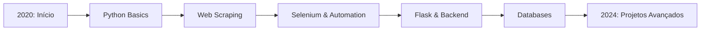

<div align="center">
  
# 👋 Olá, eu sou Matheus Villar!

### 🐍 Python Developer | Automation & Web Scraping Specialist

[](https://github.com/mathvll)
[](https://linkedin.com/in/seu-perfil)

</div>

---

## 🚀 Sobre Mim

Desenvolvedor focado em **Python** com experiência desde **2020**, especializado em automação de processos e extração de dados. Apaixonado por criar soluções eficientes que resolvem problemas reais.

```python
class Developer:
    def __init__(self):
        self.name = "Matheus Villar"
        self.role = "Python Developer"
        self.language_spoken = ["pt-BR", "en-US"]
        self.focus = ["Web Scraping", "Automation", "Backend Development"]
        
    def say_hi(self):
        print("Obrigado por visitar meu perfil! Vamos construir algo incrível juntos!")

me = Developer()
me.say_hi()
```

---

## 💼 Experiência & Projetos

### 🔍 Web Scraping & Automação
- **Sistema de Captação de Leads**: Desenvolvido um scraper automatizado para coletar clientes potenciais para website SMM
  - Stack: Python + Selenium + MongoDB
  - Automatização completa do processo de prospecção
  - Armazenamento estruturado de dados em MongoDB

### 🏢 Desenvolvimento Backend
- **CRM Personalizado**: Sistema de gestão de relacionamento com clientes
  - Framework: Flask
  - Projeto privado com funcionalidades customizadas
  - Gerenciamento completo de dados e interações

### ⚙️ Automação de Tarefas
- Experiência em criar scripts para automatizar tarefas repetitivas
- Otimização de processos e aumento de produtividade
- Soluções personalizadas para necessidades específicas

---

## 🛠️ Tecnologias & Ferramentas

### Linguagens


### Frameworks & Libraries


### Databases


### Ferramentas


---

## 📊 Estatísticas GitHub

<div align="center">
  


</div>

---

## 🎯 Áreas de Interesse

- 🕷️ **Web Scraping**: Extração e processamento de dados da web
- 🤖 **Automação**: Scripts e bots para otimização de processos
- 🌐 **Desenvolvimento Web**: Backend com Flask e APIs RESTful
- 📊 **Análise de Dados**: Processamento e visualização de dados
- 🔧 **DevOps**: Automação de deploy e infraestrutura

---

## 📈 Jornada de Aprendizado



**2020 - Presente**: Evolução contínua em Python e tecnologias relacionadas
- Fundamentos de programação e lógica
- Web scraping e automação
- Desenvolvimento backend com Flask
- Integração com bancos de dados
- Projetos reais e aplicações práticas

---

## 🤝 Vamos Conectar?

Estou sempre aberto a novos projetos, colaborações e oportunidades de aprendizado!

<div align="center">

[](mailto:seu-email@gmail.com)
[](https://linkedin.com/in/seu-perfil)
[](https://seu-portfolio.com)
[](https://twitter.com/seu-usuario)

</div>

---

<div align="center">
  
### 💡 "Code is like humor. When you have to explain it, it's bad." – Cory House


⭐️ From [mathvll](https://github.com/mathvll)

</div>
