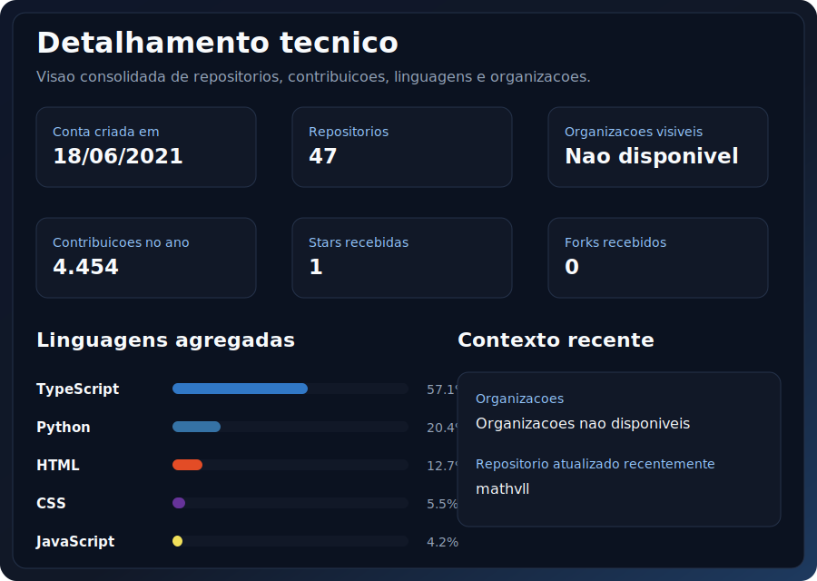

# Matheus Villar

Python developer focado em automacao, web scraping e backend para transformar tarefas manuais em fluxos previsiveis.

---

## Perfil

Desenvolvo solucoes em Python para reduzir trabalho operacional, organizar coleta de dados e transformar rotinas repetitivas em processos mais consistentes.

Quem chega por aqui vai encontrar um perfil voltado a:

- automacao de processos e tarefas internas
- web scraping com coleta estruturada e persistencia de dados
- backend leve para ferramentas internas, APIs e CRMs customizados

---

## Tecnologias

---

## Contribuicoes

## Detalhamento tecnico

## Historico de atividade

---

## Interesses tecnicos

- automacao de operacoes e rotinas internas
- scraping e monitoramento de fontes web
- modelagem simples de dados para ferramentas sob medida
- backends enxutos com foco em manutencao

---

## Contato

Aberto a conexoes, colaboracoes e conversas sobre automacao, scraping, backend e solucao de problemas com Python.
