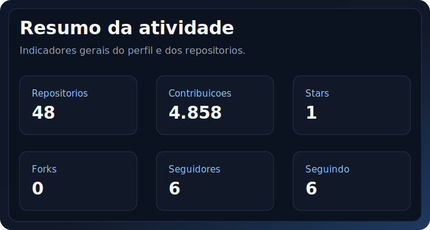
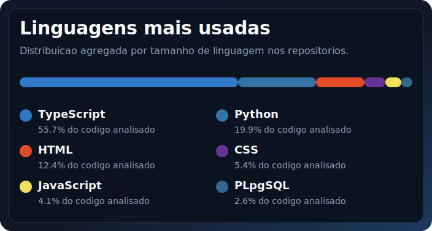

# Matheus Villar

**Não parei um dia desde que uma automação em Python trouxe, sem custo, os primeiros clientes da minha loja SMM em 2024.**

Desenvolvedor full-stack focado em SaaS B2B/B2C, automação de operações e produtos do ecossistema SMM.

## Hoje

Desde 2024, transformo problemas operacionais em software: comecei automatizando aquisição e hoje construo, mantenho e evoluo plataformas SaaS da HyppeSocial.

- Produtos web completos, do banco de dados ao frontend
- Autenticação, pagamentos, dashboards e integrações com APIs
- Automações, scraping e rotinas para reduzir trabalho manual
- Correções, novas features, migrações e manutenção de sistemas em produção

## Stack principal

## Ferramentas que uso no dia a dia

## Atividade pública

