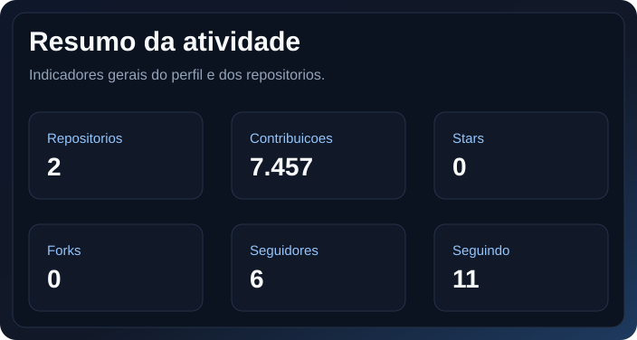
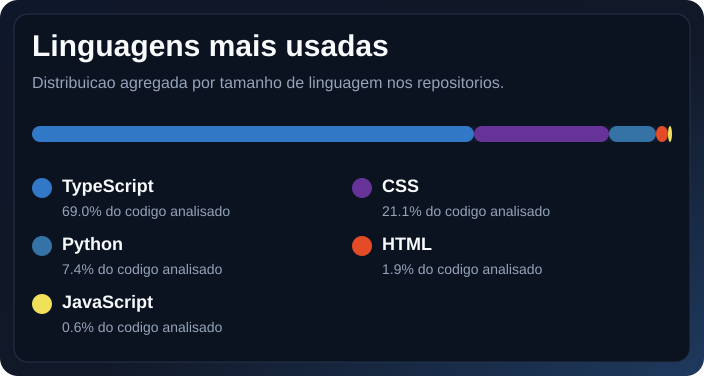

"Não parei um dia desde que uma das minhas primeiras automações em Python trouxe, sem custo, meus primeiros clientes para minha lojinha SMM em 2024."

## O que eu faço

Sou um Desenvolvedor Full Stack, então lido diariamente com implementações em sistema Web. 

### O Marketing
Além disso, tenho experiencia, gosto, e sei lidar com Marketing Digital, especificamente trafego pago.

**Experiencia**
- 2 Anos+ De experiencia com Trafego pago.
- 100K+ Conversões Realizadas no Mercado SMM.

- Grande Marco: 
43% Taxa de conversão média, em 04/2025.

com veiculos de campanhas de marketing como Google Ads + Meta Ads.

Gosto de entender como as pessoas realmente usam minhas aplicações e usar isso para decidir o que pode ser melhorado.

Quase sempre tem alguma coisa para otimizar — uma funcionalidade, um fluxo, uma consulta, uma rotina ou simplesmente uma tarefa que ainda está sendo feita manualmente.

Também gosto bastante de scripts e automações, principalmente para resolver tarefas locais e operacionais, reduzir trabalho repetitivo e deixar os sistemas mais eficientes.

No meio disso, acabo mexendo em bastante coisa: código, produto, infraestrutura, automações e decisões de negócio.

### O Foco Principal
Hoje, meu foco do dia a dia está em implementar melhorias para dentro do escopo HyppeSocial, readaptar aplicações antigas para retomar Estado de Produção.

### O que eu lido no dia a dia

* 💻 Código — full-stack, com foco em backend
* 🧠 Produto — arquitetura, decisões e evolução
* 🤖 Automação — integrações, processos e tudo que dá pra deixar rodando sozinho

* 🧠 Produto — da ideia à execução
* 💻 Código — full-stack, com carinho especial pelo backend
* 🤖 Automação — fazendo o computador trabalhar um pouco mais por mim

## Stack principal

## Ferramentas que uso no dia a dia

## Aprendendo

## Atividade pública

